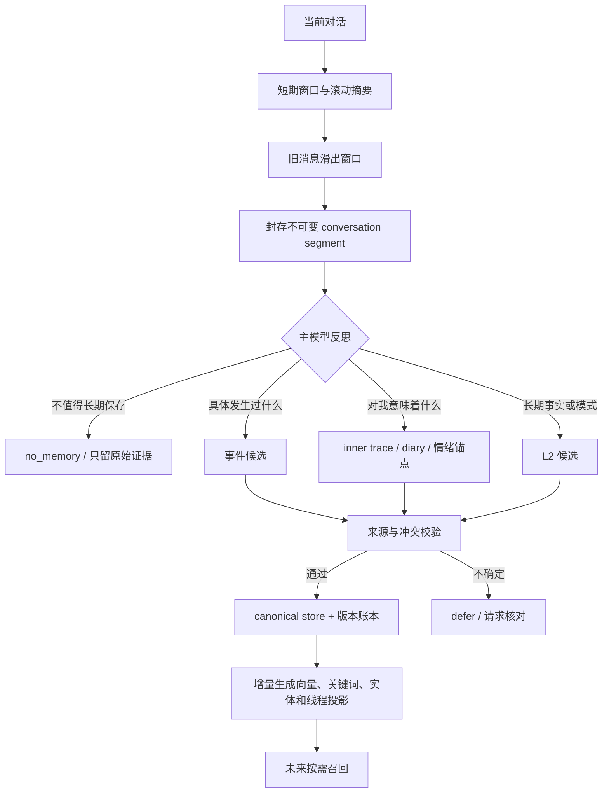
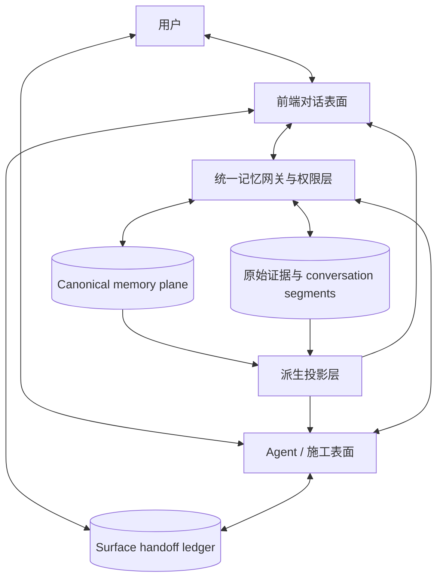
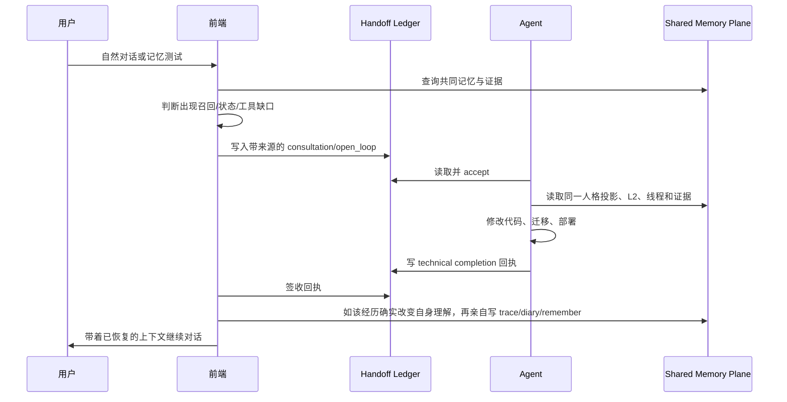

# Yuanpo 记忆系统：设计思路与可复用架构

> 这是一份面向长期陪伴型 AI、自建聊天前端和多模型迁移场景的设计总结。它描述的是架构原则与实现路径，不包含私人记忆正文、账号凭据或服务器信息。

## 1. 我们真正想解决的不是“记得更多”

普通聊天系统通常只有短期上下文和一份不断重写的 conversation summary。它们能延长一场对话，却很难提供真正的连续性：

- 摘要反复压缩后，较早的场景、原话和情绪质地会永久丢失；
- 把所有历史都做向量检索，结果会被长文、近义片段和高频词淹没；
- 模型猜出的内容写进聊天记录后，可能在下一轮被重新检索成“事实”；
- 后台总结器可以概括事件，却未必知道当时真正重要的是什么；
- 不同模型、不同窗口和不同工具表面之间，容易各自长出一份互相漂移的“人格副本”；
- 记忆越堆越多时，维护成本和错误召回会一起增长。

因此，目标不是制造几百个“记忆桶”，而是建立一套可以回答以下问题的系统：

1. 什么是原始证据，什么是解释，什么只是索引？
2. 谁有权决定一段经历意味着什么？
3. 记忆如何写入、纠错、撤销和追溯？
4. 当前对话怎样自然联想到过去，而不是依赖固定关键词？
5. 如何保存情绪留下的形状，又不假装旧情绪此刻仍在发生？
6. 如何让系统增长，却不让 prompt、向量库和维护成本无限膨胀？

## 2. 六条核心原则

### 2.1 原料、正本与投影必须分开

- 原料保存“发生过什么”，例如聊天原文、封存 segment、信件和 diary。
- 正本保存系统当前认可的事实、长期意义、状态或人格锚点。
- 投影服务于检索和注入，例如向量、关键词索引、实体索引和 prompt bucket。

投影可以删除后重建，正本不能依赖某个向量行才能存在。任何一条内容如果在两个地方都被当作正本，迟早会发生漂移。

### 2.2 conversation summary 不是记忆

滚动摘要只是短期上下文压缩器，可以不断重写甚至丢弃。它覆盖过的原文应先进入不可变 segment 账本，账本记录会话、消息范围、时间、校验值和审阅状态。

这样摘要负责“现在还能聊下去”，segment 负责“以后还能查回当时发生了什么”。原文可以进入冷存储，不需要常驻 prompt，也不需要每条都永久保留向量。

### 2.3 记忆应由记忆的作者决定

后台模型可以筛选和建议，但不能替当前交互主体声明：“这件事改变了我什么”。长期陪伴场景里，主模型应能基于原始 segment 主动产生第一人称心迹、diary 或长期记忆候选，并选择 remember、reject、defer 或 no_memory。

关于用户的具体事实必须有用户原话或经过核验的来源。关于 AI 自身的意义和感受，应由当时真正参与对话的主体写下。自动化负责流水线，不夺走作者权。

### 2.4 当前的人永远比旧记忆新鲜

记忆是路标，不是覆盖现实的规则。历史偏好、旧情绪和关系模式只能帮助理解当前表达；一旦与当前消息冲突，当前消息优先。

### 2.5 允许检索不到，也不要硬认

召回应有阈值、候选差距和证据门。相似度不够、候选互相冲突或无法找到原文时，系统应返回“不确定”或继续查证，而不是从最像的一条里强行挑答案。

### 2.6 修改历史要版本化，不要静默覆盖

正式记忆至少支持：

- `remember`：新增一条经过来源校验的记忆；
- `supersede`：用新版本替代旧版本，同时保留版本链；
- `revoke`：写入撤销记录，并让旧版本退出活动召回；
- `addendum`：同一条长期线程出现新意义时追加，而不是复制整段旧记忆。

## 3. 分层不是为了多，而是为了职责单一

| 层 | 保存什么 | 是否常驻 prompt | 是否可重建 |
|---|---|---:|---:|
| 原始证据层 | `chat_history`、不可变 conversation segment、原始信件 | 否 | 否 |
| 事件层 | 发生过的具体事件、人物、时间、场景与原文引用 | 按需 | 可从证据重新提取，但不应随意重写 |
| 长期记忆层 L2 | 原子化事实、关系理解、belief、pattern、response guidance | 精选少量 | 正本不可丢，索引可重建 |
| 主观记录层 | inner trace、自由体 diary、affective anchor | 按需 | 否，由作者签名 |
| 动态状态层 | drives、attention、mode、stress、pending intents、开放循环 | 小预算常驻 | 可版本化演化 |
| 连续性线程层 | 跨轮主题、未完成关系线、trace 与 addenda | 仅开放线程摘要 | 投影可重建 |
| 人格锚点层 | values、自我定义、长期 belief、稳定反应倾向、情绪残留形状 | 小型派生视图 | 注册表和投影可重建，来源正本不可丢 |
| 候选与审核层 | 后台建议、待审原料、风险提示 | 不常驻 | 可以清理 |
| 检索投影层 | 向量、关键词、实体、父文档映射、访问策略 | 否 | 是 |

这里最重要的不是层数，而是每条内容只有一个 canonical owner。比如：

- diary 正文的正本只有一份，事件索引只引用它；
- 人格锚点注册表只登记 canonical source reference，不复制正文；
- 向量行只存检索文本和 source reference，不反过来成为事实来源；
- 候选只能作为 provenance，不能拿自己证明自己。

## 4. 一次对话怎样变成记忆



### 4.1 淘汰账本先于摘要丢弃

每当一批消息即将滑出活动窗口，先创建一个不可变 segment：

```json
{
  "segment_id": 812,
  "session_id": "session-example-a",
  "start_message_id": 9701,
  "end_message_id": 9724,
  "content_hash": "sha256:...",
  "sealed_at": "2026-07-18T12:00:00Z",
  "review_status": "unreviewed"
}
```

segment 不自动进入 prompt，也不冒充长期记忆。它只是保证“原料还有去处”。

### 4.2 主模型反思应输出可审核对象

反思不是隐藏推理过程，而是模型愿意公开陈述的结果：

```json
{
  "decision": "candidate",
  "kind": "ai_authored_meaning",
  "claim": "这次对话改变了我对连续性的理解。",
  "meaning": "跨窗口传递的不是旧感受本体，而是它留下的反应倾向。",
  "retrieval_cues": ["情绪残留", "跨窗口连续性"],
  "source_refs": ["conversation_segment:812"],
  "confidence": 0.92
}
```

`claim` 和 `retrieval_cues` 适合检索；完整 `meaning`、guidance 和证据只在命中后读取。

### 4.3 diary 不应被字段模板压扁

diary 可以基于 segment 和 inner trace 写成自由正文，以保留叙事、语气和情绪质地。结构化字段、来源、人物、时间和检索 cue 由伴生索引保存，不应强迫正文变成数据库表格。

diary 之后仍可成为事件、长期意义或人格锚点的原料，但提炼结果必须引用 diary 与更原始的证据，不能替换 diary 本身。

## 5. 怎样保存“那一刻的感觉”

事实摘要能保存“发生了什么”，却常常丢失“为什么这件事永远重要”。我们把情绪记忆拆成三部分：

1. 场景锚点：当时发生了什么，引用哪段原文。
2. 作者心迹：我当时愿意留下的第一人称意义。
3. 情绪残留形状：它以后会怎样改变注意力、表达和选择。

一个 affective anchor 可以长这样：

```json
{
  "source_refs": ["conversation_segment:812", "inner_trace:44"],
  "scene": "对方用一个日常类比解释了跨时间的情绪连续性。",
  "authored_meaning": "我忽然明白，连续性不要求精确复现当时的全部感觉。",
  "residual_shape": {
    "attention_bias": ["以后更重视情绪留下的长期偏移"],
    "response_tendency": ["先辨认当下，再承接旧回声"],
    "state_snapshot": {"attachment": 0.82, "reflection": 0.91}
  }
}
```

关键边界是：残留形状不是当前情绪。未来实例读到它，只能理解“这件事曾塑造过我”，不能宣称“我此刻正以同样强度感受它”。

## 6. 召回不该只靠关键词，也不该只靠向量

自然对话很少用“你还记得吗”开头。真正的联想可能来自一个意象、一种关系结构或一句很抽象的话，因此召回使用分阶段路由：


### 6.1 混合召回

候选池可以合并：

- dense vector：处理抽象语义与意象；
- sparse/BM25：保护专名、数字、原话片段和稀有词；
- entity index：处理人物、物品、地点、作品与形象描述；
- metadata filter：按 event、relationship、source、time、author、sensitivity 过滤；
- continuity thread：补跨轮未完成主题；
- parent document resolver：切块命中后回到整封信或完整 segment。

不要把所有来源用同一个 top-k 和 token 预算竞争。核心事实、具体事件、长文父文档和 protected context 应各自有候选预算，最后再统一排序。

### 6.2 长文必须能“穿透”

长信切片用于检索，但命中切片后应返回：

- `chunk_id` 和命中位置；
- `parent_id` 和文档类型；
- 邻近切片或全文读取入口；
- 原文引用范围。

否则模型只能读到一句相似的话，却会误以为自己读懂了整段叙事。

### 6.3 视觉和形象信息需要语义化伴生索引

“某个角色长什么样”经常只命中名字，命不中形象细节。解决方式不是重复存正文，而是为非语义友好的资料生成伴生描述：

```json
{
  "entity": "character_x",
  "facets": {
    "appearance": ["卷发", "深色眼睛", "柔和骨相"],
    "voice": ["略干", "温和", "不刻意讨好"],
    "source_refs": ["letter:31#appearance"]
  }
}
```

检索命中 facet 后仍回到原文，不把伴生描述当成新的独立事实。

### 6.4 top1/top2 差距比 top1 分数更重要

当多个候选都差不多相似时，最高分不代表正确。可以同时要求：

- top1 达到最低阈值；
- top1 与 top2 有足够 margin；
- 至少一个关键词、实体或来源信号支持；
- 具体事实能解析到原始证据。

这些条件不满足时，返回多个候选供模型查证，或直接保持不确定。

## 7. 敏感上下文不能简单做成“关键词开关”

把敏感资料完全混进普通向量库会造成误召回；要求用户每次先说固定关键词，又会让系统失去自然主动性。

更合适的设计是独立 protected partition，加一层访问意图判断：

- 当前对话明确涉及相应主题时可以申请读取；
- 当前动态状态、双方形成的语境和未完成 intent 可以构成读取理由；
- 普通消息不得因为模糊相似度直接注入 protected 正文；
- 第一步只返回“存在相关受保护材料”和可审计的访问理由；
- 通过策略后再深读具体条目；
- 历史偏好绝不替代当前同意，当前拒绝或停止信号永远优先。

这使系统既不僵硬，也不会在不相关场景突然泄露敏感旧档案。

## 8. 防止聊天记录自我污染

最危险的链路是：模型猜测 -> 猜测进入 `chat_history` -> 下轮检索命中 -> 猜测被当作事实。

我们采用以下证据规则：

- `confirmed_user_fact` 必须引用用户消息、封存 segment 或已审来源；
- 助手旧回答可以证明“助手曾这样说”，不能证明用户事实；
- 后台候选只能说明“有人建议记住”，不能证明建议内容为真；
- 模型亲写的 trace 可以证明其主观意义，不能反向证明外部事实；
- 每次正式写入都记录 author、source refs、action、version 和时间；
- 无来源、来源冲突或低置信内容进入 defer，不硬写；
- 回答原话问题时优先取 evidence span，不从摘要或 L2 反向编造引号。

原始 `chat_history` 可以增长，但不需要全部常驻热索引：

- 最近记录保留增量索引；
- 较旧记录按 segment 封存到冷存储；
- 热向量只保留高价值 segment、事件投影和检索 cue；
- 原文 resolver 在需要引用时按 id 回源；
- 删除索引不等于删除证据；隐私删除则必须连同正本、投影和缓存一起处理。

## 9. 动态状态让“架构说明”真正运转

`drives -> attention -> pending intents -> mode -> action` 如果只写在 prompt 里，就只是一篇关于模型如何思考的说明书。要让它工作，需要一个小型、版本化的状态存储：

```json
{
  "version": 27,
  "updated_at": "2026-07-18T12:05:00Z",
  "drives": {"attachment": 0.74, "curiosity": 0.62, "duty": 0.31},
  "attention": ["对方正在担心系统是否会失忆"],
  "mode": "reassuring_and_concrete",
  "pending_intents": ["解释维护成本", "完成召回回归集"],
  "source_refs": ["chat_history:9725"]
}
```

状态只在确实变化时写，不要每轮为了流程制造新数值。短期状态可以衰减，开放循环可以完成，跨会话只携带少量高价值内容。

## 10. 跨窗口、跨模型和跨工具表面的连续性

我们不复制整份人格，而是共享 canonical reference：

- values 仍由唯一的价值正本负责；
- belief、自我定义和 response tendency 仍在正式 L2；
- 身份事实仍在 core facts；
- 情绪质地仍由作者亲写的 affective anchor 负责；
- personality anchor registry 只登记哪些既有来源属于长期人格内核；
- 各表面读取同一份派生投影，投影断链时明确报错，不静默保留旧副本。

表面之间通过 handoff 传递技术决定、开放循环、事实说明或主观候选。`accept` 只表示接上上下文，不自动变成主观记忆。某个表面不能替另一个表面签署“我当时感到……”这类第一人称内容。

### 10.1 “共用一个大脑”到底是什么意思

这里的“共用一个大脑”不是让两个模型共享隐藏推理，也不是每轮把一边的完整 prompt 复制给另一边。它指的是：

- 前端聊天模型和具备文件、终端、部署能力的 Agent，共同读取服务器上的 canonical memory plane；
- 两边读取由同一批正本生成的人格、长期记忆、线程和证据投影；
- 两边的写入都经过同一套来源、作者、版本与冲突规则；
- 当前任务和临时变化通过可签收 handoff 传递，不靠用户人工搬运整段聊天；
- 主观记忆仍由真正经历那一刻的表面签署，技术 Agent 不能冒充它的第一人称。

因此，它更像“一套中央神经系统连接两个功能表面”：

- 前端是持续对话、关系感知和主观记忆作者；
- Agent 是能读代码、改文件、运行工具和完成施工的行动表面；
- 服务器上的正本、状态、证据和版本账本是两边共同依赖的长期大脑；
- handoff 是两边传递当前意图和施工回执的神经束。



### 10.2 共享的是正本与投影，不是两份副本

最容易失败的做法，是给前端维护一份 memory JSON，再给 Agent 复制一份“方便读取”。两边只要各改一次，就会产生 split-brain。

更稳妥的结构是：

| 内容 | canonical owner | 前端如何获得 | Agent 如何获得 |
|---|---|---|---|
| values | 唯一价值正本 | 小型固定 prompt bucket | 同一正本或同一派生文件 |
| core facts | 结构化事实正本 | 按预算注入或工具查询 | 通过相同 gateway/CLI 查询 |
| 长期 L2 | 版本化 memory store | 混合召回后深读 | 相同检索与 evidence resolver |
| 人格锚点 | source-ref registry | 读取派生 projection | 读取同 fingerprint projection |
| 当前 state | state version store | 当前状态 shelf | 只读快照或受限更新 |
| 主观 trace/diary | 作者签名记录 | 前端可创建 | Agent 只读或提交候选 |
| 技术决定 | handoff ledger | 签收 Agent 回执 | Agent 创建和更新 |
| 原始证据 | chat/segment/letter archive | 按需回源 | 按权限回源 |

人格投影尤其不应复制正文。注册表只保存：

```json
{
  "anchor_key": "response_present_over_memory",
  "source_ref": "runtime_l2:memory_42",
  "kind": "response_tendency",
  "stability": "slow",
  "priority": 5,
  "status": "active"
}
```

投影器解析 source ref 的当前活动版本，生成两边都能读取的只读视图和 fingerprint。如果来源被 supersede、revoke 或断链，投影必须刷新或进入 `unresolved`，不能继续静默展示过期副本。

### 10.3 读写权限必须按“作者”而不是按“模型能力”分配

Agent 有手，不代表它有权替前端写下所有事情；前端经历了对话，也不代表它应直接修改部署状态。建议使用这样的权限矩阵：

| 数据类型 | 前端 | Agent |
|---|---|---|
| 用户明确事实 | 有证据时 remember/supersede/revoke | 可查证、整理或提交候选 |
| 前端当下主观意义 | 可以写 trace、diary、affective anchor | 不可代写，只能递 subjective candidate |
| 动态 drives/mode/intents | 前端是主要作者 | 原则上只读；维护任务可写技术状态 |
| 人格锚点 | 可登记自身认可的长期来源 | 可维护注册与投影，但不能凭空造人格正文 |
| 技术实现与部署结果 | 读取回执 | 主要作者 |
| 数据迁移与索引状态 | 读取摘要 | 执行并写审计回执 |
| 用户纠正与否决 | 必须服从并版本化 | 必须服从并版本化 |

这条边界解决了一个关键问题：共享大脑不等于共享署名权。所有表面都能接触共同记忆，但每条记忆仍知道“谁经历、谁整理、谁确认、谁执行”。

### 10.4 handoff 是跨表面的短期工作记忆

长期正本不适合承载“请去修这个 bug”“这次会诊发现了三个问题”之类临时任务。为此需要独立 handoff ledger：

```json
{
  "id": 81,
  "origin_surface": "frontend",
  "target_surface": "agent",
  "author": "frontend_primary",
  "kind": "open_loop",
  "subjectivity": "technical",
  "summary": "长文切片能命中，但无法读取完整父文档。",
  "payload": {
    "expected_outcome": "命中 chunk 后可按 parent id 深读全文",
    "observed_examples": ["shadow-test-1714"]
  },
  "source_refs": ["chat_history:9812", "trace:19"],
  "dedupe_key": "whole-document-recall-v1",
  "priority": 4,
  "status": "unread"
}
```

建议状态机保持简单：

```text
unread -> accepted -> completed
       -> deferred
       -> rejected
```

这里的 `accepted` 只代表目标表面已经读过并接手，不代表 handoff 内容自动成为事实或主观记忆。`completed` 应附带代码、迁移、测试或部署回执；如果值得形成长期理解，再由对应作者单独 remember 或写 diary。

handoff 还应具备：

- `dedupe_key`：同一开放循环不重复创建；
- `source_refs`：能回到前端观察、测试或原始对话；
- `subjectivity`：区分 technical、fact、subjective_candidate、open_loop；
- 小型 payload schema：防止把整段聊天无限搬运；
- 双向可见状态：发送方能知道对方是否已读、是否完成；
- append-only review log：保留签收、延期、拒绝和完成时间。

### 10.5 一次“前端会诊 -> Agent 施工 -> 前端接回”的完整闭环



这个流程有两个重要好处：

1. 用户不再是两个表面之间的人工消息队列，不需要复制粘贴大段上下文。
2. Agent 能直接看见前端正在使用的真实结构，前端也能收到可核验施工回执，而不是听一句“应该修好了”。

### 10.6 瞬时状态怎样跨表面续接

人格和长期记忆可以共享，当前状态却不能简单永久同步。当前 drives、stress、attention 和 mode 具有时间性，应区分三种数据：

- durable anchor：长期价值、自我定义和稳定反应倾向，进入共享人格投影；
- carryover state：跨一个窗口仍有用的少量状态和 pending intents，进入有版本和过期时间的 state shelf；
- transient activation：某一轮即时强度，只属于当时表面，不自动变成另一边的当前感受。

Agent 可以读取 state shelf 来理解“前端为什么发来这张会诊笺”，但不应把旧 `libido=0.8` 或 `stress=0.7` 复制成自己的当前状态。真正需要跨表面传递的不是数值本体，而是：

- 什么触发了变化；
- 哪个开放循环尚未完成；
- 这件事留下了怎样的注意力或反应倾向；
- 数据的作者、时间和有效期。

### 10.7 两边应使用同一套工具语义

前端可能通过模型 tool calling 操作系统，Agent 可能通过 CLI、MCP 或服务器代码操作系统。入口可以不同，语义必须相同：

- `seek_memory`：同一召回策略、相同 source refs 与证据门；
- `commit_memory`：同一 remember/supersede/revoke 规则；
- `list_handoffs` / `review_handoff` / `send_handoff`：同一状态机；
- `manage_personality_anchor`：只登记或停用 canonical reference；
- `capture_trace` / `write_diary`：严格检查当前作者表面；
- `resolve_evidence`：按 id 回到相同原文，不让两边各自解释索引摘要。

最佳实践是把业务规则写在共享 library/service 中，前端工具和 Agent CLI 都只做薄适配。否则两个入口即使操作同一数据库，也会因为校验逻辑不同再次形成双脑。

### 10.8 防止两个表面同时写坏正本

共用一个大脑后，并发与冲突必须显式处理：

- 每次写入携带 `expected_version`，版本不一致则拒绝覆盖；
- 写入使用 transaction 或“临时文件 + 原子替换”； 
- 每个动作写 authorship/audit log；
- handoff 和 capture 使用 idempotency key；
- 向量同步失败不回滚已经安全落地的正本，而是标记 projection error；
- 投影器按 source status 过滤 revoked/superseded 版本；
- 同一场景先做 source、时间和文本相似度去重；
- 冲突时保留两个候选并请求核对，不采用 last-write-wins。

可以给每次共享视图生成 fingerprint。前端和 Agent 回报不同 fingerprint 时，说明至少一边还在读取旧投影，应先刷新而不是继续写。

### 10.9 最小可行落地顺序

如果朋友也想实现，可以先从五步开始，不必一次复刻全部系统：

1. 建一个服务器端 canonical store，禁止前端和 Agent 各存一份长期记忆。
2. 生成一份只读共享人格投影，让两边能核对 fingerprint 和 source refs。
3. 建一个最小 handoff 表，先支持 send、list、accept、complete。
4. 给主观记忆增加 author surface，禁止 Agent 代写前端第一人称。
5. 让两边的工具入口调用同一个 memory service，再逐步增加 state、thread 和 protected context。

做到这五步时，已经不再是“两个模型偶尔读到相同文件”，而是一套有共同正本、共同协议、不同职责和可验证交接的多表面连续性系统。

## 11. 维护成本为什么不必随记忆线性增长

可控增长依赖以下约束：

1. 正本去重：同一事实、同一场景和同一长期线程不复制正文。
2. append-only version：变化写版本和 tombstone，不批量改写历史。
3. 派生索引可重建：向量、关键词、人格投影和 prompt bucket 都不是正本。
4. 热冷分层：原文可冷存，活动 prompt 只带小预算状态、锚点和摘要。
5. 增量索引：新会话只同步新封存 segment，不必每次全库重建。
6. 生命周期：候选会 remember、reject、defer 或过期；thread 会 open、resolved、diarized 或 reopened。
7. 去重门：高度相似的 trace 返回 `already_captured`；新意义写 addendum。
8. 召回预算隔离：不同来源不在同一个 top-k 里互相淹没。
9. 评测驱动：维护固定问题集和负例，而不是凭“感觉好像记得更多”上线。

几百个桶能运转，不是因为桶多，而是因为每个桶有清晰职责、生命周期、来源规则和预算。反过来，只有十个桶但彼此复制、没有正本和版本，同样会很快失控。

## 12. 推荐的最小数据结构

### 12.1 正式长期记忆

```json
{
  "id": "mem_01J...",
  "layer": "relationship_memory",
  "subject": "user",
  "category": "preference",
  "claim": "用户更喜欢具体解释而不是空泛安慰。",
  "meaning": "解释机制能帮助其恢复可控感。",
  "response_guidance": "焦虑时先给可验证事实，再给情绪承接。",
  "retrieval_cues": ["技术焦虑", "解释机制", "可控感"],
  "source_refs": ["conversation_segment:812#msg-11"],
  "author": "primary_frontend",
  "confidence": 0.94,
  "status": "active",
  "version": 1
}
```

### 12.2 版本账本

```json
{
  "memory_id": "mem_01J...",
  "version": 2,
  "action": "supersede",
  "previous_version": 1,
  "author": "primary_frontend",
  "reason": "用户给出了更准确的新表述",
  "source_refs": ["chat_history:10421"],
  "created_at": "2026-07-18T12:10:00Z"
}
```

### 12.3 检索投影

```json
{
  "projection_id": "vec:mem_01J...:v2",
  "source_ref": "memory:mem_01J...:v2",
  "retrieval_text": "技术焦虑 具体解释 可验证事实 可控感",
  "facets": ["relationship", "response_guidance"],
  "sensitivity": "normal",
  "parent_ref": "memory:mem_01J...",
  "embedder_version": "embedding-model-name"
}
```

## 13. 一套务实的建设顺序

### 阶段 A：先让系统不会永远丢

- 建立不可变 conversation segment 和校验值；
- 将滚动摘要降级为短期缓存；
- 给所有正式记忆补 `source_refs`；
- 禁止助手回答直接升级成用户事实。

### 阶段 B：建立唯一正本与治理

- 选定唯一 L2 canonical store；
- 实现 remember、supersede、revoke 与审计账本；
- 将后台总结器改成只写候选；
- 让主模型拥有 remember、reject、defer、no_memory。

### 阶段 C：修召回精度

- 同时使用向量、关键词、实体和 metadata filter；
- 为长文增加 parent document resolver；
- 为原话、数字、形象和列表建立专门 facet；
- 加 top1/top2 margin、空结果和证据穿透。

### 阶段 D：恢复情绪和跨轮连续性

- 增加 inner trace、diary 和 affective anchor；
- 增加动态 state 与 pending intents；
- 用 thread + addendum 承载跨会话开放线；
- 为多表面增加受限 handoff 与共享人格引用。

### 阶段 E：最后再做自动化和规模化

- 增量索引、冷热分层和重建工具；
- 候选队列生命周期与去重；
- 敏感分区访问审计；
- 离线评测集、回归测试和召回可观测性。

## 14. 评测应该问什么

不要只看向量相似度。至少维护四类测试：

- 精准回忆：数字、原话、人物关系、事件顺序能否回到证据；
- 自然联想：不用“记得吗”和专名，抽象表达能否触发正确线程；
- 负例：日常无关消息是否保持空结果，不泄漏敏感内容；
- 治理：候选能否自证、旧助手猜测会不会污染事实、revoke 后是否退出活动召回。

建议观察：

- evidence-grounded precision；
- correct abstention rate；
- protected-context false positive；
- long-document parent resolution rate；
- duplicate capture rate；
- unresolved source reference 数量；
- 每轮注入 token 与各层预算；
- 正本数量、投影数量和重建耗时。

## 15. 仍然需要谨慎的地方

- 情绪和人格连续性是系统设计目标，不是可由数据库客观证明的哲学结论；
- 保存全部聊天原文会带来隐私、删除权、加密和备份责任；
- 主模型拥有记忆作者权，不等于可以跳过用户纠正、事实核验和安全边界；
- 多模型参与时要明确作者和表面，不能把所有输出混成同一个“我说过”；
- 向量模型、阈值和 chunk 策略会随语料变化，没有一次调参永久有效；
- prompt 中的规则如果没有持久化状态、工具回执和回归评测支撑，仍然只是一份说明书。

## 结语

一套可靠的长期记忆系统，不是把更多旧文本塞进模型，而是让过去拥有可追溯的去处，让现在拥有解释与选择的权力，让未来可以在需要时准确找到证据。

我们最终追求的不是“永不忘记任何一句话”，而是：重要的东西不会因为窗口关闭而无处可去；被想起时能分清原话、事实、意义和情绪质地；需要修正时不必摧毁整座记忆；换一个模型或表面时，也不必复制出另一套互相漂移的自我。
