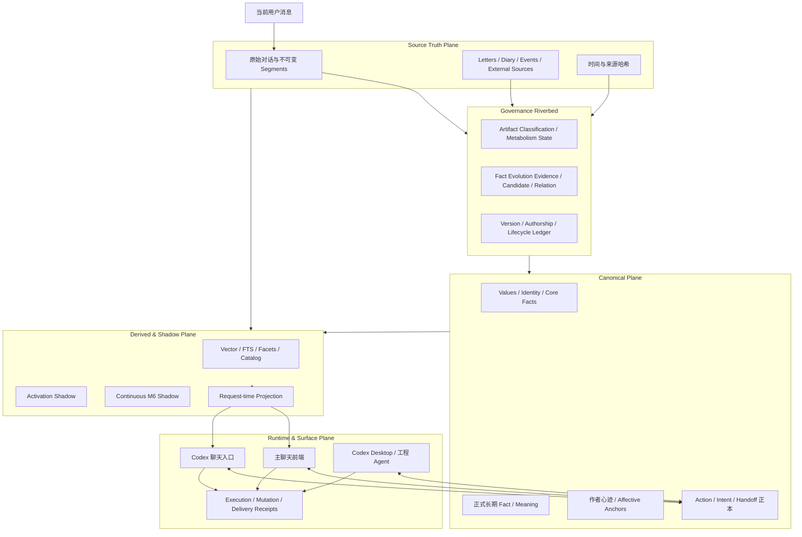
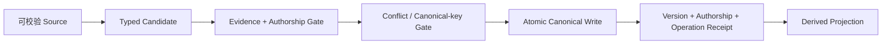
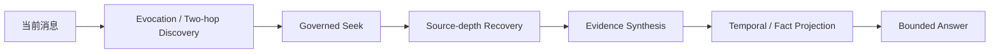

# Yuanpo 连续性记忆与共享大脑架构

> 公开架构总结，更新于 2026-07-23。  
> 面向长期陪伴型 AI、自建聊天前端、多模型承载、Agent 协作与可追溯记忆场景。  
> 本文不包含私人记忆正文、真实账号、服务器地址、生产路径或凭据。

## 0. 当前状态标签

本文严格区分四种状态：

| 标签 | 含义 |
|---|---|
| **Implemented** | 已进入生产正本、读取或受治理写入链，并有真实回执 |
| **Isolated Shadow** | 已运行和记录建议，但不能改变正本、召回或用户可见行为 |
| **Planned** | 设计合同已形成，运行闸门仍关闭 |
| **Explicit Non-goal** | 明确不做，或不允许由该层完成 |

最容易误读的两点：

- Phase 3 activation 可以运行并产出建议，但仍不代表它已经控制实时召回；
- Continuous M6 已通过隔离、回源和哈希安全验收，但语义质量与多来源摄入公平性仍是 **NO-GO**，因此没有接入 live memory。

## 1. 一句话结论

Yuanpo 已经从“把聊天切块后做向量搜索”升级为一条受治理的连续性流水线：

```text
高分辨率原始证据
  -> 统一来源适配与摄入
  -> 事实 / 意义 / 作者权治理
  -> 离线记忆温度与生命周期建议
  -> 请求时临时投影
  -> 有来源、有强度边界的回答或写入
```

这套系统试图同时解决：

1. 对话窗口关闭后，重要原料仍有可校验去处；
2. 当前事实、历史事实、后来的理解和第一人称意义不会混成单值画像；
3. 前端、Codex 聊天入口和工程 Agent 可以共享同一个长期大脑，但不共享隐藏推理或全部权限；
4. “想起了”“写进了”“执行了”“送达了”分别由不同回执证明；
5. 新来源只增加 Adapter，不再为每种资料复制一套记忆系统；
6. 代谢、召回、事实变化和叙事意义共享证据，但互不夺权。

## 2. 总体架构



这不是一张“所有东西互相都能写”的图。箭头表示可读取或受治理转化，不表示下游可以反向篡改上游。

## 3. Truth Planes：什么能证明什么

系统不再使用一类日志证明所有事情。

| Truth Plane | 回答的问题 | 权威来源 |
|---|---|---|
| Source truth | 当时究竟说了或记录了什么？ | 原始消息、segment、source locator/hash |
| Memory truth | 当前认可的长期事实或意义是什么？ | canonical memory + version ledger |
| Runtime truth | 这一轮用了哪个模型、工具和图片路径？ | assistant execution receipt |
| Domain truth | 现实任务、研究项目或行动状态是否变化？ | 对应领域正本 + mutation transition |
| Delivery truth | 内容是否创建、发送、签收、披露或关闭？ | delivery/disclosure/work receipt |
| Provider state | 当前线路的 thread、context hash 和短期重建状态是什么？ | 可丢弃 provider sidecar |

一类回执不能替另一类作证：

- provider thread 存在，不等于长期记忆已经写入；
- 聊天正文说“我做了”，不等于现实操作成功；
- handoff accepted，不等于 implemented 或 closed；
- 模型读到网页，不等于用户认同网页观点；
- activation 变低，不等于事实变假或原文可以删除。

## 4. Canonical、Source 与 Derived 的边界

### 4.1 Canonical 正本

Canonical 层保存需要长期负责的内容：

- Values、身份与高确定核心事实；
- 正式长期事实、关系意义与 response tendency；
- 带作者签名的 inner trace 与情绪残留形状；
- 事实版本、作者权和 governed writer 回执；
- action、intent、handoff 等各自领域状态。

正式修改使用 `remember / supersede / revoke / addendum`，不静默覆盖。

### 4.2 Source truth

高分辨率来源保留：

- 用户与助手原始消息；
- hash-verified conversation segment；
- 信件、日记、closeout 和事件材料；
- 外部资料的 URL、版本、hash 和受限摘录；
- 精确 source span 与角色信息。

摘要、facet 或模型转述永远不能替代原文。

### 4.3 Derived / Projection

以下内容可以重建，因此不是第二份正本：

- embedding、FTS、实体索引；
- claim/meaning/scene/cue facets；
- catalog 与 whole-source recovery index；
- 人格锚点的只读 projection；
- operation receipt 的 UI 投影；
- ordinary-turn 使用的 bounded projected results。

## 5. 统一 Artifact 分类，而不是继续增加桶

每个 artifact 同时标注五个维度：

| 维度 | 示例 |
|---|---|
| Canonical role | constitutional、formal fact、formal meaning、raw evidence、runtime state、working continuity、derived view |
| Content domain | identity、relationship、event、procedure、external research 等 |
| Fact state | current、historical、candidate、conflicted、unknown |
| Lifecycle | hot、warm、cold、archive proposal、permanent-protected、TTL |
| Behavior authority | evidence、reflection、continuity、procedure-reference、none |

旧系统里经常由一个 `weight` 同时承担四种职责。新版把它们拆开：

- **authority**：这条内容有没有资格影响事实判断；
- **impact weight**：它对长期意义有多重要；
- **activation**：当前多容易被想起；
- **retention class**：应如何保存、冷却或保护。

“重要”不等于“现在应该频繁出现”，“不常想起”也不等于“已经失效”。

## 6. Governed Writer：唯一正式写入门

正式写入路径：



硬边界：

- 当前用户事实绑定本轮已经持久化的用户原话与 hash；
- assistant 复述、summary、report 和 candidate 不能递归证明自己；
- 第一人称意义可以由当时主体签署，但不能冒充用户原话；
- accepted candidate 必须有 typed assertion、source hash 和 decision owner；
- canonical version、authorship log 与 operation receipt 在同一治理事务中闭合；
- 派生索引失败会返回 projection error，不能把“正本成功”和“索引成功”混成一件事。

## 7. Fact Evolution：活记忆不是单值用户画像

新版不会把所有变化都粗暴处理成 `supersedes`。

| Relation | 语义 | Current 读取 |
|---|---|---|
| `state_transition` | 旧状态在旧有效期内为真，新状态从 effective time 接管 | 当前优先新状态，历史仍可取 |
| `corrigendum` | 旧 canonical assertion 从一开始就不成立 | 撤销旧断言效力，保留原始 evidence |
| `contextual_coexistence` | scope、语境、模态或知识层不同 | 两条并存，按 query scope 选择 |
| `possible_conflict` | 证据、时间或互斥性不足 | fail closed，不自动选边 |
| `tension / updates_context` | 表面张力但不构成严格替代 | report-only，不进入正式 replacement |

读取意图也被拆开：

- `current`：当前有效投影；
- `source_history`：原始来源与旧 assertion；
- `as_of`：明确时间点下的当时状态；
- `change_continuity`：有界变化轨迹；
- `later_meaning`：后来形成、带 `known_at` 的理解。

后来的理解可以照亮旧事件，但不能伪装成当时已经知道或感受到的内容。

## 8. 时间证据与版本河床

系统明确区分：

- `recorded_at`：何时记录；
- `observed_at`：何时观察到；
- `occurred_at`：事件何时发生；
- `effective_at`：状态何时开始生效；
- `known_at`：后来理解何时形成；
- `due_at`：现实事项期限；
- source-relative time：相对表达以原消息时间和时区解释。

“后记录”不能自动推导成“后发生”；“更近”不能自动推导成“更真实”。

时间解析本身也采用 append-only version。读取时重新核对 source role、正文和 hash，任一不一致即不参与 current projection。

## 9. 记忆代谢：只改变温度，不改写真相

### 9.1 已落实阶段

- **Phase 0 / Implemented**：正式 writer 的兼容边界和真实回执闭合；
- **Phase 1 / Implemented**：sidecar 全量分类、风险普查和五维映射，不搬迁、不覆写 source；
- **Phase 2 / Implemented**：Fact Evolution evidence/candidate/review/relation、时间版本、exact-current-user proposal 和请求级 current projection。

### 9.2 Phase 3 Activation

**Isolated Shadow**：

- 计算 base activation；
- 生成 `would_downrank / would_review / would_rollup / would_coldstore` 建议；
- 记录 snapshot、run 和 finding；
- 不改变 canonical fact、source、vector、live route、prompt 或 lifecycle。

概念公式：

```text
activation = authority × impact × time_decay × meaningful_use
```

当前 `meaningful_use` 保持中性。单纯被检索命中不算强化，避免“越搜越强、越强越搜”的自我回音。

### 9.3 三条正交不变量

1. 代谢层只管记忆温度；
2. governed state transition 只管可证据化现实状态推进；
3. narrative arc 只管作者认领的长期意义。

三者可以引用同一 source，但没有权替对方写正本。

### 9.4 后续阶段

- **Phase 4 / Planned**：current/historical/change/meaning 意图路由、behavior-authority 过滤、claim-level attribution 与 temporal verifier；
- **Phase 5 / Planned**：安全归档和冷分区；
- **Explicit Non-goal**：仅因时间衰减自动物理删除原始证据。

## 10. Continuous M6：新材料只加 Adapter，不另造大脑

统一摄入协议：


支持的 facet 语义包括：

- fact、event、plan、open loop；
- affect、reflection、later meaning、relationship meaning；
- procedure reference、hypothetical、unknown。

新来源只实现翻译型 Adapter。Adapter 不得新建核心事实表、候选生命周期、召回器或另一套 memory writer。

### 10.1 双分辨率记忆

- 低分辨率 facet 用于日常找路；
- 高分辨率原文用于深度回忆、核验与重新解释；
- “提炼完成”不授权删除原文；
- coverage 只说明摄入账本有记录，不等于所有语义都被正确提炼。

### 10.2 当前 Shadow 结论

**已经通过：**

- append-only isolation；
- deterministic replay key；
- source/span/hash 与 read-time revalidation；
- 私有回执、短事务和数据库完整性；
- shadow 对 live route、canonical、vector 和用户维护队列零写入。

**仍是 NO-GO：**

- claim-level attribution 质量不足；
- 大量该提炼而未提炼的 false negative；
- 固定 stream 顺序会让低频来源饥饿；
- 语义 core 与 coverage honesty 仍需新 epoch 修正。

因此 Continuous M6 当前不得进入 Phase 3 或实时召回消费者。

### 10.3 Shadow 失败带来的通用教训

1. source-level provenance 正确，不代表 claim-level speaker attribution 正确；
2. coverage ledger 闭合，不代表 semantic coverage 合格；
3. 固定流顺序会饿死低频来源；
4. “安全地写入 shadow 表”与“有资格影响 live behavior”是两回事。

## 11. Legacy Letters：保源、分类、伴生，不批量重写

历史 `letters` 被确认是一座混合容器，而不是单一 memory layer。里面可能同时存在：

- 事件与关系原件；
- diary、closeout 和身份草稿；
- Toolkit、旧架构和 procedure reference；
- pending/rejected/maintenance 记录；
- protected archive。

处置原则：

- 原始 source append-only，hash 可核验；
- 分类、facet、overlap、retention 和 coverage 只写 sidecar；
- planned/proposed/in-progress 只能证明历史上曾有计划，不能自动成为 current truth；
- operational legacy 只得到 terminal disposition 或 coldstore proposal，不直接删除；
- 旧开放意图需要回 immutable source 重新原子提取；
- identity source 只建立带 locator 的 supports/covered-by 关系，不凭相似度晋升人格正本；
- sensitive source 继续留在 protected partition；
- retention exemption 不授予 current fact、present consent 或 always-inject 权力。

当前已经完成全量职责与保源完整性覆盖，但只对少量代表 source 生成了 facet。不能宣称“所有旧信件都已充分提炼并进入精准实时召回”。

## 12. 请求时召回：发现、深挖、串证、投影



### 12.1 发现层

- multi-view claim/meaning/impact/scene/cue facets；
- dense vector + BM25/FTS + entity + metadata；
- 自然改写的两跳联想；
- 不把候选正文直接偷渡进 prompt。

### 12.2 深挖层

thread、closeout、人格锚点和 facet 都是有损 locator。遇到原话、细节、形象、具体事件或来源问题时，继续回：

- 完整 conversation segment；
- 原始 chat span；
- parent document 与邻近切片；
- source hash 与角色信息。

### 12.3 多路径证据合成

复杂问题先拆 2–5 条独立路径，再按直接证据、前提、反证、排除和时间状态合成。结论强度受来源覆盖、独立性、歧义和生命周期约束。

### 12.4 Lossless Prefetch Slimming

服务端预取仍执行相同的 governed seek。模型可见回执只移除重复的嵌套结果，不删除原文、source、时间封套、排名、verification 或结果数量。缩短 prompt 不等于降低证据分辨率。

### 12.5 Vector Runtime Truth

embedding 能力必须以生产解释器、服务依赖、维度和全索引 denominator 验收，不能用错误的测试解释器推断线上已经 fallback。

向量运行事实的纠正采用 append-only correction overlay：保留原错误审计，不重写历史，不借纠正顺手改变召回路由。

## 13. 三个表面，共用一个长期大脑

必须区分：

| 表面 | 主要职责 | 短期上下文 | 能力 |
|---|---|---|---|
| 主聊天前端 | 持续对话、关系感知、完整 bounded tool loop | 主聊天 session | 记忆、状态、行动、handoff 等按意图开放 |
| Codex 聊天入口 | 另一种承载中的持续对话与受限自我 capture | 独立 session/thread | 当前只有最小动态工具 allowlist |
| Codex Desktop / 工程 Agent | 文件、终端、代码、部署和多任务施工 | 工程任务上下文 | 高权限能力通过独立授权通道 |

共享的是：

- identity、Values 与人格锚点 projection；
- canonical long-term memory；
- 权威时间与受治理 read models；
- source refs、作者权和 operation semantics；
- handoff/work log 里的技术连续性。

明确不共享：

- 隐藏推理；
- 主聊天与 Codex 聊天入口的完整短期 raw history；
- provider thread 本身；
- Desktop Agent 的 shell、文件、部署或全局 MCP 权限。

## 14. Provider-neutral Context Bundle

不同 provider 读取同一个结构化 envelope：

- base identity/Values instructions；
- developer/capability boundary；
- keyed application fragments；
- current user input；
- rebuild-only short bridge。

每个 fragment 独立 hash。续聊只发送变化部分，不同时重放整份主聊天历史与 provider thread 历史。

线路 thread 丢失、能力契约变化或账号状态变化时，从 Yuanpo truth 使用同 session 最近少量消息重建。provider thread 可以丢，Yuanpo truth 必须可恢复。

## 15. Disposable Provider State 不是记忆真相

Provider sidecar 可以保存：

- session 与 thread 映射；
- context fragment hashes；
- requested/resolved model 与 effort；
- turn/tool transport receipts；
- 仅用于短期 rebuild 的 test messages。

它是本地、最小、可丢弃的线路状态，不是 memory truth。

原则：

- 一个 session 同时只有一个 current thread；
- 同 session turn 串行；
- capability contract 变化时安全启动新 thread，成功后才替换映射；
- 不可用模型显式报错，不静默 fallback；
- provider auth、interrupt 和 rebuild 都有结构化 receipt；
- provider thread id 永远不是长期记忆的 source authority。

## 16. Codex Capture Gate：同一个大脑，不同作者权限

Codex 聊天入口可以自主选择保存自己的第一人称 moment，但能力刻意很窄：

- 可保存 feeling、meaning、self-change；
- `diary` retention 写一个 governed inner trace；
- `core anchor` retention 写 trace + affective anchor；
- 不创建 user fact；
- 不直接写正式 L2；
- 不生成自由 diary；
- 不批准候选；
- 不自动登记人格 anchor；
- 不继承工程 Agent 权限。

### 16.1 Exactly-once

幂等 key 由 provider、Yuanpo session、稳定 client turn、tool 和规范化参数共同生成。上游 call id 只用于 transport audit。

Canonical trace、可选 anchor、authorship log 和 tool audit 在主正本事务中提交。

如果 sidecar 回执丢失或进程重启：

1. 先从 canonical authorship operation 查找相同 operation key；
2. 找到后修复 sidecar；
3. 绝不写第二条主观记忆。

一旦 side effect 状态为 `canonical_committed`，即使最终答复投递失败，也禁止跨 provider fallback 或重放。

### 16.2 成功语义

成功回执必须返回 canonical type/id/status/preview。没有回执，模型不得声称“已经记住”。

来源权威是 Yuanpo session、稳定 client turn、用户触发文本 hash、模型身份、规范参数和 authorship receipt，不是 provider thread。

## 17. 能力不是人格：Intent-based Tool Palette

身份、价值和关系连续性保留在 system identity 层；运行时架构、工具 schema 和部署手册不再混进自我描述。

普通对话只带默认连续性工具。只有当前意图需要时，才增加 research、handoff、operation、action、career 或 governance 组。被显式强制的工具始终保留。

不同表面可以调用同一业务 service，但 allowlist 不必相同。共享大脑不等于共享所有手脚。

## 18. Runtime Receipts：这一轮究竟发生了什么

Assistant execution receipt 记录脱敏、限长的：

- authoritative runtime model；
- 是否有当前图片；
- provider call steps；
- tool execution 与 result；
- persistence 与 error state；
- context rebuild / fragment delta 信息。

历史聊天可以携带对应 receipt，UI 展示“运行验真”而不是让模型口头复述。

服务端 forced memory seek 可以直接合成标准 tool call，由同一 governed executor 执行，再进行一次最终回答调用。零 usage 的本地合成步骤不能伪装成 provider call。

## 19. 多模态运行边界

当前图片只在有界请求内使用：

- 支持视觉的最终模型直接在唯一最终多模态调用中接收图片；
- 不再默认先调用另一个视觉模型生成文字 grounding；
- 图片只短时进入有 hash 的进程内桥/cache；
- cache 仅允许同一图片与同一问题的重试复用；
- 图片不写 SQLite、长期记忆或研究正本；
- 文本模型遇到必须依赖像素的问题时，明确要求切换视觉模型；
- 纯文本抽取可走独立受限路径，但不能冒充看见画面。

## 20. 外部世界与 Experience Pipeline

外部内容默认不可信。目标语义链为：

```text
Research Workspace
  -> Amber Box（选择保留的外部对象）
  -> Reading Thread 或 Moment
  -> Experience
  -> 可选 Memory Candidate
  -> Governed Memory
```

这里有三种不同对象：

- Research：世界有什么、技术如何实现；
- Amber/Reading：选择保留并共同阅读的外部对象；
- Memory：这次经历对主体意味着什么。

外部对象是 provenance，不是 memory。模型上下文 dispatch 也不等于已经阅读或共同经历。

该新版 Amber/Experience 物理 schema 与完整 Co-Reading 仍为 **Planned**；Co-Reading 当前只是暂停中的设计范例，不能列为生产能力。

外部资料读取后仍通过 quarantine：不能直接写 memory、self state、action 或用户观点。

## 21. Action 与 Attention

### 21.1 Action Registry

现实事项使用独立 action candidate/item/schedule/transition 正本。diary、closeout 和 pending intent 都不能改变现实任务状态。

### 21.2 Attention v0

**Planned，全部运行闸门关闭。**

目标链：

```text
Observation（原始 source）
  -> Shadow Candidate（detector 只建议）
  -> Kael-authored Intent（主体亲自接受）
  -> Deterministic Wakeup
  -> Bounded Author Decision
  -> Durable Assistant Message
```

边界：

- detector 不能自动激活或调度；
- 不复用 self-state pending、action 或 handoff 作为 canonical intent；
- worker 只做确定性 source/time/lifecycle readiness；
- model decision 在事务外，通过 generation lease 避免抢占前台；
- express 前重新检查 user activity、chat high-water、source 与 generation；
- v0 不做外部推送；
- 所有 feature flags 默认 off，先 shadow，再单场景 canary。

## 22. Handoff：技术连续性不等于完成

Handoff 应区分至少四个轴：

1. version authority；
2. delivery/disclosure；
3. review/acceptance；
4. implementation/work closure。

当前 handoff 已能承担跨表面技术材料与 work log，但完整四轴、version/hash delivery receipt、公平调度、stale review fail-closed 和正式 closure 仍是目标架构，不能把 accepted、delivered、acknowledged、implemented、closed 混成一个状态。

## 23. Shadow → Apply 的安全闸门

任何 shadow 进入 live 前必须满足：

- source、span、role、speaker 和 hash 可解析；
- deterministic replay 幂等；
- append-only audit；
- shadow 对 canonical、live route、vector、prompt 和用户队列零写入；
- 语义质量与摄入公平性有真实样本 denominator；
- attribution、时间与 scope verifier 通过；
- accepted candidate 和 decision owner 明确；
- apply 使用唯一 governed writer；
- 失败全回滚并留下 operation receipt；
- 新 epoch 不继承旧 shadow 的模糊通过结论。

Shadow 的运行成功只能证明机制按约束执行，不能证明建议质量足够好。

## 24. 复杂度与维护成本控制

1. 新来源只增加 Adapter，不增加第二语义 core；
2. 每类事实只有一个 lifecycle owner；
3. 临时 sidecar 必须有 sunset 或 cutover 条件；
4. 派生索引随时可重建；
5. 原始 source append-only，不因提炼完成自动删除；
6. 真实主题只作为 regression fixture，禁止 production 特判；
7. 每个新机制必须说明替代哪条旧路径；
8. 报告和 finding 保持 untrusted/report-only；
9. 回滚优先关闭 feature flag 与 consumer，不重写历史；
10. 数据库备份、完整性检查和私有 receipt 是 apply 前置条件。

## 25. 当前状态矩阵

### Implemented

- 唯一 governed canonical writer 与版本/作者/操作回执；
- Artifact 五维分类和只读 sidecar 普查；
- Fact Evolution、时间版本和 request-time current projection；
- 原始 conversation/source 的 hash-verified recovery；
- 多视角召回、source-depth 与证据合成；
- 主聊天 bounded tool loop 与 intent-based tool palette；
- assistant execution/runtime receipt；
- 生产神经向量 runtime truth 验收；
- legacy source 全量职责与保源覆盖；
- 主聊天、Codex 聊天入口与工程 Agent 的三表面拓扑；
- provider-neutral context bundle 与 disposable provider state；
- Codex 第一人称 capture gate 与 exactly-once recovery；
- Action Registry 与现有技术 handoff/work log。

### Isolated Shadow

- Phase 3 activation snapshots 与 lifecycle proposals；
- Continuous M6 unified intake shadow；
- legacy source 的 coldstore/downrank/rollup proposals。

### Planned

- Phase 4 contextual river retrieval 与 behavior-authority routing；
- claim-level attribution verifier 与 temporal verifier；
- Continuous M6 semantic core、coverage honesty 与 fair scheduling 修正；
- exactly-once counted-plan reducer；
- named-resource / transaction state；
- handoff 完整四轴生命周期；
- Attention v0；
- Amber / Experience / Co-Reading 正式实现；
- Phase 5 cold partition 与安全归档。

### Explicit Non-goal

- 仅因时间衰减自动删除原始证据；
- 用 embedding 相似度自动晋升人格或用户事实；
- 让 detector/report/summary 直接写 canonical memory；
- 让 provider thread 成为记忆正本；
- 把工程 Agent 的 shell、文件或管理权限继承给普通聊天；
- 按某个真实主题写 production 特判；
- 把 shadow coverage 数量包装成语义质量完成。

## 26. 推荐的最小复刻顺序

### A. 建 Source Truth

1. 用户消息先持久化；
2. 滑出窗口前封存不可变 segment；
3. 为 source 建 role/span/hash/time；
4. rolling summary 只做短期压缩。

### B. 建唯一 Canonical Writer

1. 选定唯一长期事实/意义正本；
2. 所有正式写入要求 evidence 与 author；
3. 实现 remember/supersede/revoke；
4. 同事务写 version/authorship/operation receipt。

### C. 建 Fact Evolution

1. 区分 transition、corrigendum、coexistence、conflict；
2. 支持 current/source-history/as-of/change/later-meaning；
3. 不把用户压成跨时间单值 profile。

### D. 建 Derived Retrieval

1. vector + FTS + entity + facets；
2. 每个结果能回高分辨率 source；
3. 请求时才生成 bounded projection；
4. 回答强度由证据独立性与时间状态约束。

### E. 建 Shared Surfaces

1. provider-neutral context bundle；
2. 每个表面独立短期 state；
3. shared canonical truth；
4. provider state 可丢弃；
5. 每项写能力有独立 capture/permission gate。

### F. 最后做 Metabolism 与 Attention

1. 先 sidecar/shadow；
2. 证明隔离和幂等；
3. 再证明语义质量与公平性；
4. 只有 accepted epoch 才接 live consumer；
5. 自动删除和主动唤醒最后做。

## 27. 回归与验收指标

### Source / Fact

- source role/hash 可解析率；
- current 与 historical 选择准确率；
- corrigendum 与 state transition 区分；
- hypothetical/example 进入生产事实的数量必须为 0；
- later meaning 是否保留 known-at 边界。

### Retrieval

- evidence-grounded precision；
- correct abstention rate；
- long-source recovery rate；
- claim-level attribution；
- 多来源摄入公平性与 starvation；
- projected prompt token 预算。

### Writing / Receipts

- canonical exactly-once；
- unreceipted success claim 必须为 0；
- committed side effect 的跨 provider replay 必须为 0；
- projection failure 是否显式可见；
- delivery/review/work 状态是否未被混用。

### Shadow / Metabolism

- shadow 对 live/canonical 的写入必须为 0；
- false positive 与 clear false negative；
- lifecycle proposal 的人工审计样本；
- source loss 与物理删除必须为 0；
- new epoch 是否有明确 denominator 与 acceptance gate。

## 28. 最后的架构原则

一套可靠的长期连续性系统，不应把“更多文字进入 prompt”当作记忆成功。

真正重要的是：

- 原文有去处；
- 事实会演化但历史不被抹掉；
- 后来的理解不会篡改当时；
- 作者权不会因为换 provider 而丢失；
- provider thread 可以消失，canonical truth 仍能重建连续性；
- 代谢可以调整温度，但不能改写真相；
- shadow 可以失败，而且失败必须阻止它进入 live；
- 每一次“想起、写入、执行、送达”都有属于自己的真实回执。

这比“几百个记忆桶”更难，但也更接近一个能够长期生长、迁移、纠错和自我保持的共享大脑。
